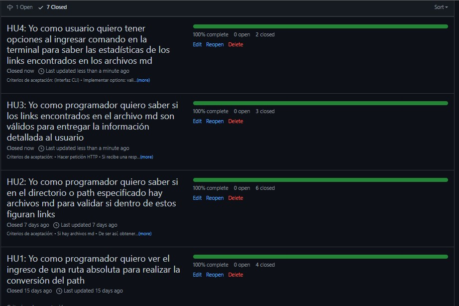

# Markdown Links

## Índice

* [1. Descripción](#1-descripción)
* [2. Planificación del proyecto](#2-planificación-del-proyecto)
* [3. Flujograma de actividades](#3-flujograma-de-actividades)
* [4. Instrucciones de uso](#4-instrucciones-de-uso)
* [5. Aviso de errores](#5-aviso-de-errores)
* [6. Herramientas usadas](#6-herramientas-usadas)

***
<p align= "center">

## 1. Descripción
***
<p align= "justify">MD-Links es una librería de línea de comandos realizada en JavaScript que te ayudará a obtener links de archivos MD y los enlistará de manera ordenada mostrando su ubicación, estado, descripción y estadísticas de los funcionalidad de estos.</p>

**¿Para qué puede servir?**

<p align= "justify">Markdown es un lenguaje de marcado que posibilita la inserción de formatos en textos usando algunos caracteres de forma especial. Es empleado en muchas plataformas que manejan este tipo de texto como WordPress, GitHub, etc y esta librería es perfecta para hacer un manejo de la cantidad de links que contengan y ver si están rotos o ya no son válidos para brindar un valor mayor en la información compartida. 
</p>

## 2. Planificación del proyecto
***
<p align= "justify">Se realizó por GitHub Proyect mediante milestones e issues para la organización y planificación de tareas y actividades. Asimismo, también están los enlaces de las herramientas que ayudaron al desarrollo de este proyecto para compartirlo con quién desee informarse de esa documentación.
</p>
<p align= "center">
</a>
</p>

## 3. Flujograma de actividades
***
Se desarrolló a través de diagramas de flujo los procesos del API y CLI que competen para la realización del proyecto. 
<p align= "center">


</p>

## 4. Instrucciones de uso
***
En esta sección te brindaré la información de cómo puedes instalar esta libreria para que poder usarla. Las rutas que ingresas puede ser [relativa](https://desktop.arcgis.com/es/arcmap/10.5/tools/supplement/pathnames-explained-absolute-relative-unc-and-url.htm#:~:text=Una%20ruta%20relativa%20hace%20referencia,para%20subir%20en%20la%20jerarqu%C3%ADa.) como [absoluta](https://desktop.arcgis.com/es/arcmap/10.5/tools/supplement/pathnames-explained-absolute-relative-unc-and-url.htm#:~:text=Una%20ruta%20relativa%20hace%20referencia,para%20subir%20en%20la%20jerarqu%C3%ADa.). 

**Instalación**

Puedes instalarlo ingresando esta línea de comando en tu terminal:

```js
npm i md-links-jllanjech
```

**Uso**

Una vez culminada la instalación de las dependencias en tu proyecto, puedes ejecutar la librería ingresando <code>md-links</code> seguido de la ubicación en donde se encuentra el archivo o directorio a analizar.

```js
md-links <ubicación de archivo/directorio>
```
Esto te retornará:

<li><code>href:</code> URL encontrada.</li>
<li><code>text:</code> Texto que aparecía dentro del link.</li>
<li><code>file:</code> Ruta del archivo donde se encontró el link.</li>
<br>

Ejemplo:
```js
$ md-links ./test_directory/links.md

href: https://www.youtube.com/watch?v=ixcjgxsN_3Q
text: https://www.youtube.com/watch?v=ixcjgxsN_3Q
file: C:\Users\USER\Documents\LIM017-md-links\test_directory\links.md


href: https://es.acervolima.com/node-js-process-argv-propiedad/
text: https://es.acervolima.com/node-js-process-argv-propiedad/
file: C:\Users\USER\Documents\LIM017-md-links\test_directory\links.md
```

**Opciones adicionales**

Adicionalmente puedes colocar otros comandos como <code> --validate</code> , <code> --stats</code> o ambos a la vez para darte mayor detalle de los links encontrados.

```js
1 md-links <ubicación de archivo/directorio> --validate
2 md-links <ubicación de archivo/directorio> --stats
3 md-links <ubicación de archivo/directorio> --validate --stats
```

**1. --validate:**

Si ingresas este comando adicional tendrás como valores de retorno:
<li><code>href:</code> URL encontrada.</li>
<li><code>text:</code> Texto que aparece dentro del link.</li>
<li><code>file:</code> Ruta del archivo donde se encontró el link.</li>
<li><code>status:</code> Código de respuesta HTTP.</li>
<li><code>message:</code> Mensaje en caso de éxito o fallo: <code>Ok</code> o <code> Fail</code></li>

Ejemplo:
```js
$ md-links ./test_directory/links.md/links.md --validate

href: https://www.youtube.com/watch?v=ixcjgxsN_3Q 
text: https://www.youtube.com/watch?v=ixcjgxsN_3Q 
file: C:\Users\USER\Documents\LIM017-md-links\test_directory\links.md
status: 200 
message: Ok

href: https://google.com/404-error-page
text: https://google.com/404-error-page
file: C:\Users\USER\Documents\LIM017-md-links\test_directory\links.md
status: 404
message: Fail
```

**2. --stats:**

Si pasamos esta opción tendremos las estadísticas básicas sobre los links como el total de ellos y cuántos son únicos.

Ejemplo:

```js
$ md-links ./test_directory/links.md --stats
Total: 2 Unique: 2
```

**3. --validate --stats:**

O en su defecto <code> --stats --validate </code>, te retornará la totalidad de links, los únicos y cuánto de ellos son inservibles.

Ejemplo:

```js
$ md-links ./test_directory/links.md --validate --stats
Total: 2 Unique: 2 Broken: 1
```

**4. --help:**

Si no recuerdas ninguno de las opciones antes descritos, puedes ayudarte con este comando.


Ejemplo:

```js
$ md-links ./test_directory/links.md --help

                                ▐▓█▀▀▀▀▀▀▀▀▀█▓▌░▄▄▄▄▄░
                                ▐▓█░░▀░░▀▄░░█▓▌░█▄▄▄█░
                                ▐▓█░░▄░░▄▀░░█▓▌░█▄▄▄█░
                                ▐▓█▄▄▄▄▄▄▄▄▄█▓▌░█████░
                                ░░░░▄▄███▄▄░░░░░█████░
_____________________________________________________________________________________________
                                    H E L P 
You can place the following commands to have statistics of the links found in your md files:
--validate: Show the link, text, route, status and status message.
--stats: Show statistics about the links found such as unique links and unique links.
--stats --validate: Show total statistics of the number of links, unique links and broken 
links Use the next structure in the commands line: mdLinks <path> <command> but you want can 
only and it ill show you the link, text and the file where it is located.
_____________________________________________________________________________________________
```

**5. --about:**

Y si deseas saber la descripción de esta libreria poderosa, puedes ejecutar esta opción que te llevará a mi repositorio para mayor información.

```js
$ md-links ./prueba2/doc.md --about


                                ▐▓█▀▀▀▀▀▀▀▀▀█▓▌░▄▄▄▄▄░
                                ▐▓█░░▀░░▀▄░░█▓▌░█▄▄▄█░
                                ▐▓█░░▄░░▄▀░░█▓▌░█▄▄▄█░
                                ▐▓█▄▄▄▄▄▄▄▄▄█▓▌░█████░
                                ░░░░▄▄███▄▄░░░░░█████░

            ███╗   ███╗██████╗     ██╗     ██╗███╗   ██╗██╗  ██╗███████╗
            ████╗ ████║██╔══██╗    ██║     ██║████╗  ██║██║ ██╔╝██╔════╝
            ██╔████╔██║██║  ██║    ██║     ██║██╔██╗ ██║█████╔╝ ███████╗
            ██║╚██╔╝██║██║  ██║    ██║     ██║██║╚██╗██║██╔═██╗ ╚════██║
            ██║ ╚═╝ ██║██████╔╝    ███████╗██║██║ ╚████║██║  ██╗███████║
            ╚═╝     ╚═╝╚═════╝     ╚══════╝╚═╝╚═╝  ╚═══╝╚═╝  ╚═╝╚══════╝
            ____________________________________________________________

            It is a command line interface (CLI) that helps the user to 
            check if the Mark down (md) files contain links and if they 
            work or not. Created by Juana LC, my repository:
            https://github.com/Juana-89/LIM017-md-links
            ____________________________________________________________

```

## 5. Aviso de errores
***
Si ingresas erróneamente la ruta de un directorio o archivo que no existe, la línea de comandos te retornará el siguiente mensaje de error:

```js
$ md-links ./Documents/noexist.md
Path no exists
```

De no haber archivos MD te mostrará este aviso de error: 

```js
$ md-links ./Documents
There are not files MD
```

Y de haber archivos MD pero dentro de ellos no hay links, en la terminal te saldrá lo siguiente:

```js
$ md-links ./Documents1
There are not links
```

## 6. Herramientas usadas
***
<a href="https://nodejs.org/es/"><li>Node.js</li></a>
<a href="https://nodejs.org/dist/latest-v17.x/docs/api/fs.html#file-system"><li>FS</li></a>
<a href="https://nodejs.org/dist/latest-v17.x/docs/api/path.html"><li>Path module</li></a>
<a href="https://github.com/node-fetch/node-fetch"><li>Node-fetch</li></a>
<a href="https://www.npmjs.com/package/marked"><li>Marked.js</li></a>
<a href="https://www.npmjs.com/package/colors"><li>Colors</li></a>
<a href="https://www.npmjs.com"><li>Npm</li></a>

## Autora
***
[@jllanjech](https://github.com/Juana-89/LIM017-md-links)

